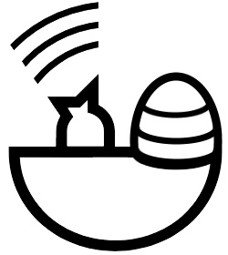

# ChirpNest

<!-- PROJECT LOGO -->
<br />
<p align="center">
  <a href="https://github.com/ChirpNest/ChirpNest">
    
  </a>

  <h3 align="center">ChirpNest</h3>

  <p align="center">
    The internet-less solution for LoRaWAN devices
    <br />
    <br />
    <a href="https://github.com/ChirpNest/ChirpNest/issues">Report Bug</a>
    ·
    <a href="https://github.com/ChirpNest/ChirpNest/issues">Request Feature</a>
  </p>
</p>


## Table of Contents
* [About The Project](#about-the-project)
* [Getting Started](#getting-started)
  * [Prerequisites](#prerequisites)
  * [A. Get prepared ChirpNest image](#a-get-prepared-ChirpNest-image)
  * [B. Prepare the LORIX One device](#b-prepare-the-lorix-one-device)
  * [C. Initial setup LORIX One with the ChirpStack web interface](#c-initial-setup-lorix-one-with-the-chirpStack-web-interface)
  * [D. Configure ChirpNest with the ChirpStack Web Interface](#d-configure-chirpnest-with-the-chirpStack-web-interface)
  * [E. Connect KIWI Desktop with ChirpNest](#e-connect-kiwi-desktop-with-chirpnest)
  * [F. Configure ADT1 Device](#f-configure-adt1-device)
  * [G. Build your own ChirpNest image](#g-build-your-own-chirpnest-image)
    * [G1. Create ChirpNest image](#g1-create-chirpnest-image)
    * [G2A. Use prepared 'KIWI Server' module](#g2a-use-prepared-kiwi-server-module)
    * [G2B. Build 'KIWI Server' module](#g2b-build-kiwi-server-module)
  * [How to decode](#how-to-decode)
* [License](#license)
* [Acknowledgements](#acknowledgements)

## About The Project
[](https://www.youtube.com/watch?v=TjCiR6i7mAU "Intro")

[TODO]


## Getting Started
Follow this guide to set up and start with ChirpNest

[![](https://mermaid.ink/img/eyJjb2RlIjoiZ3JhcGggVERcbiAgICBBW0EuIEdldCBwcmVwYXJlZCBDaGlycE5lc3QgaW1hZ2VdIC0tPiBCKEIuIFByZXBhcmUgdGhlIExPUklYIE9uZSBkZXZpY2UpXG4gICAgQiAtLT4gQyhDLiBJbml0aWFsIHNldHVwIExPUklYIE9uZSB3aXRoIHRoZSBDaGlycFN0YWNrIHdlYiBpbnRlcmZhY2UpXG4gICAgQyAtLT4gRChELiBDb25maWd1cmUgQ2hpcnBOZXN0IHdpdGggdGhlIENoaXJwU3RhY2sgd2ViIGludGVyZmFjZSlcbiAgICBEIC0tPiBFKEUuIENvbm5lY3QgS0lXSSBEZXNrdG9wIHdpdGggQ2hpcnBOZXN0KVxuICAgIEUgLS0-IEYoRi4gQ29uZmlndXJlIEFEVDEgZGV2aWNlKVxuXG4gICAgc3ViZ3JhcGggaWRlMSBbRy4gQnVpbGQgeW91ciBvd24gQ2hpcnBOZXN0IGltYWdlXVxuICAgIEcxKEcxLiBDcmVhdGUgQ2hpcnBOZXN0IGltYWdlKS0tPkcyQShHMkEuIFVzZSBwcmVwYXJlZCAnS0lXSSBTZXJ2ZXInIG1vZHVsZSlcbiAgICBHMS0tPkcyQihHMkIuIEJ1aWxkICdLSVdJIFNlcnZlcicgbW9kdWxlKVxuICAgIGVuZFxuICAgIFxuICAgIEcyQSAtLT4gQlxuICAgIEcyQiAtLT4gQiIsIm1lcm1haWQiOnsidGhlbWVWYXJpYWJsZXMiOnsiYmFja2dyb3VuZCI6IndoaXRlIiwicHJpbWFyeUNvbG9yIjoiI0VDRUNGRiIsInNlY29uZGFyeUNvbG9yIjoiI2ZmZmZkZSIsInRlcnRpYXJ5Q29sb3IiOiJoc2woODAsIDEwMCUsIDk2LjI3NDUwOTgwMzklKSIsInByaW1hcnlCb3JkZXJDb2xvciI6ImhzbCgyNDAsIDYwJSwgODYuMjc0NTA5ODAzOSUpIiwic2Vjb25kYXJ5Qm9yZGVyQ29sb3IiOiJoc2woNjAsIDYwJSwgODMuNTI5NDExNzY0NyUpIiwidGVydGlhcnlCb3JkZXJDb2xvciI6ImhzbCg4MCwgNjAlLCA4Ni4yNzQ1MDk4MDM5JSkiLCJwcmltYXJ5VGV4dENvbG9yIjoiIzEzMTMwMCIsInNlY29uZGFyeVRleHRDb2xvciI6IiMwMDAwMjEiLCJ0ZXJ0aWFyeVRleHRDb2xvciI6InJnYig5LjUwMDAwMDAwMDEsIDkuNTAwMDAwMDAwMSwgOS41MDAwMDAwMDAxKSIsImxpbmVDb2xvciI6IiMzMzMzMzMiLCJ0ZXh0Q29sb3IiOiIjMzMzIiwibWFpbkJrZyI6IiNFQ0VDRkYiLCJzZWNvbmRCa2ciOiIjZmZmZmRlIiwiYm9yZGVyMSI6IiM5MzcwREIiLCJib3JkZXIyIjoiI2FhYWEzMyIsImFycm93aGVhZENvbG9yIjoiIzMzMzMzMyIsImZvbnRGYW1pbHkiOiJcInRyZWJ1Y2hldCBtc1wiLCB2ZXJkYW5hLCBhcmlhbCIsImZvbnRTaXplIjoiMTZweCIsImxhYmVsQmFja2dyb3VuZCI6IiNlOGU4ZTgiLCJub2RlQmtnIjoiI0VDRUNGRiIsIm5vZGVCb3JkZXIiOiIjOTM3MERCIiwiY2x1c3RlckJrZyI6IiNmZmZmZGUiLCJjbHVzdGVyQm9yZGVyIjoiI2FhYWEzMyIsImRlZmF1bHRMaW5rQ29sb3IiOiIjMzMzMzMzIiwidGl0bGVDb2xvciI6IiMzMzMiLCJlZGdlTGFiZWxCYWNrZ3JvdW5kIjoiI2U4ZThlOCIsImFjdG9yQm9yZGVyIjoiaHNsKDI1OS42MjYxNjgyMjQzLCA1OS43NzY1MzYzMTI4JSwgODcuOTAxOTYwNzg0MyUpIiwiYWN0b3JCa2ciOiIjRUNFQ0ZGIiwiYWN0b3JUZXh0Q29sb3IiOiJibGFjayIsImFjdG9yTGluZUNvbG9yIjoiZ3JleSIsInNpZ25hbENvbG9yIjoiIzMzMyIsInNpZ25hbFRleHRDb2xvciI6IiMzMzMiLCJsYWJlbEJveEJrZ0NvbG9yIjoiI0VDRUNGRiIsImxhYmVsQm94Qm9yZGVyQ29sb3IiOiJoc2woMjU5LjYyNjE2ODIyNDMsIDU5Ljc3NjUzNjMxMjglLCA4Ny45MDE5NjA3ODQzJSkiLCJsYWJlbFRleHRDb2xvciI6ImJsYWNrIiwibG9vcFRleHRDb2xvciI6ImJsYWNrIiwibm90ZUJvcmRlckNvbG9yIjoiI2FhYWEzMyIsIm5vdGVCa2dDb2xvciI6IiNmZmY1YWQiLCJub3RlVGV4dENvbG9yIjoiYmxhY2siLCJhY3RpdmF0aW9uQm9yZGVyQ29sb3IiOiIjNjY2IiwiYWN0aXZhdGlvbkJrZ0NvbG9yIjoiI2Y0ZjRmNCIsInNlcXVlbmNlTnVtYmVyQ29sb3IiOiJ3aGl0ZSIsInNlY3Rpb25Ca2dDb2xvciI6InJnYmEoMTAyLCAxMDIsIDI1NSwgMC40OSkiLCJhbHRTZWN0aW9uQmtnQ29sb3IiOiJ3aGl0ZSIsInNlY3Rpb25Ca2dDb2xvcjIiOiIjZmZmNDAwIiwidGFza0JvcmRlckNvbG9yIjoiIzUzNGZiYyIsInRhc2tCa2dDb2xvciI6IiM4YTkwZGQiLCJ0YXNrVGV4dExpZ2h0Q29sb3IiOiJ3aGl0ZSIsInRhc2tUZXh0Q29sb3IiOiJ3aGl0ZSIsInRhc2tUZXh0RGFya0NvbG9yIjoiYmxhY2siLCJ0YXNrVGV4dE91dHNpZGVDb2xvciI6ImJsYWNrIiwidGFza1RleHRDbGlja2FibGVDb2xvciI6IiMwMDMxNjMiLCJhY3RpdmVUYXNrQm9yZGVyQ29sb3IiOiIjNTM0ZmJjIiwiYWN0aXZlVGFza0JrZ0NvbG9yIjoiI2JmYzdmZiIsImdyaWRDb2xvciI6ImxpZ2h0Z3JleSIsImRvbmVUYXNrQmtnQ29sb3IiOiJsaWdodGdyZXkiLCJkb25lVGFza0JvcmRlckNvbG9yIjoiZ3JleSIsImNyaXRCb3JkZXJDb2xvciI6IiNmZjg4ODgiLCJjcml0QmtnQ29sb3IiOiJyZWQiLCJ0b2RheUxpbmVDb2xvciI6InJlZCIsImxhYmVsQ29sb3IiOiJibGFjayIsImVycm9yQmtnQ29sb3IiOiIjNTUyMjIyIiwiZXJyb3JUZXh0Q29sb3IiOiIjNTUyMjIyIiwiY2xhc3NUZXh0IjoiIzEzMTMwMCIsImZpbGxUeXBlMCI6IiNFQ0VDRkYiLCJmaWxsVHlwZTEiOiIjZmZmZmRlIiwiZmlsbFR5cGUyIjoiaHNsKDMwNCwgMTAwJSwgOTYuMjc0NTA5ODAzOSUpIiwiZmlsbFR5cGUzIjoiaHNsKDEyNCwgMTAwJSwgOTMuNTI5NDExNzY0NyUpIiwiZmlsbFR5cGU0IjoiaHNsKDE3NiwgMTAwJSwgOTYuMjc0NTA5ODAzOSUpIiwiZmlsbFR5cGU1IjoiaHNsKC00LCAxMDAlLCA5My41Mjk0MTE3NjQ3JSkiLCJmaWxsVHlwZTYiOiJoc2woOCwgMTAwJSwgOTYuMjc0NTA5ODAzOSUpIiwiZmlsbFR5cGU3IjoiaHNsKDE4OCwgMTAwJSwgOTMuNTI5NDExNzY0NyUpIn19LCJ1cGRhdGVFZGl0b3IiOmZhbHNlfQ)](https://mermaid-js.github.io/mermaid-live-editor/#/edit/eyJjb2RlIjoiZ3JhcGggVERcbiAgICBBW0EuIEdldCBwcmVwYXJlZCBDaGlycE5lc3QgaW1hZ2VdIC0tPiBCKEIuIFByZXBhcmUgdGhlIExPUklYIE9uZSBkZXZpY2UpXG4gICAgQiAtLT4gQyhDLiBJbml0aWFsIHNldHVwIExPUklYIE9uZSB3aXRoIHRoZSBDaGlycFN0YWNrIHdlYiBpbnRlcmZhY2UpXG4gICAgQyAtLT4gRChELiBDb25maWd1cmUgQ2hpcnBOZXN0IHdpdGggdGhlIENoaXJwU3RhY2sgd2ViIGludGVyZmFjZSlcbiAgICBEIC0tPiBFKEUuIENvbm5lY3QgS0lXSSBEZXNrdG9wIHdpdGggQ2hpcnBOZXN0KVxuICAgIEUgLS0-IEYoRi4gQ29uZmlndXJlIEFEVDEgZGV2aWNlKVxuXG4gICAgc3ViZ3JhcGggaWRlMSBbRy4gQnVpbGQgeW91ciBvd24gQ2hpcnBOZXN0IGltYWdlXVxuICAgIEcxKEcxLiBDcmVhdGUgQ2hpcnBOZXN0IGltYWdlKS0tPkcyQShHMkEuIFVzZSBwcmVwYXJlZCAnS0lXSSBTZXJ2ZXInIG1vZHVsZSlcbiAgICBHMS0tPkcyQihHMkIuIEJ1aWxkICdLSVdJIFNlcnZlcicgbW9kdWxlKVxuICAgIGVuZFxuICAgIFxuICAgIEcyQSAtLT4gQlxuICAgIEcyQiAtLT4gQiIsIm1lcm1haWQiOnsidGhlbWVWYXJpYWJsZXMiOnsiYmFja2dyb3VuZCI6IndoaXRlIiwicHJpbWFyeUNvbG9yIjoiI0VDRUNGRiIsInNlY29uZGFyeUNvbG9yIjoiI2ZmZmZkZSIsInRlcnRpYXJ5Q29sb3IiOiJoc2woODAsIDEwMCUsIDk2LjI3NDUwOTgwMzklKSIsInByaW1hcnlCb3JkZXJDb2xvciI6ImhzbCgyNDAsIDYwJSwgODYuMjc0NTA5ODAzOSUpIiwic2Vjb25kYXJ5Qm9yZGVyQ29sb3IiOiJoc2woNjAsIDYwJSwgODMuNTI5NDExNzY0NyUpIiwidGVydGlhcnlCb3JkZXJDb2xvciI6ImhzbCg4MCwgNjAlLCA4Ni4yNzQ1MDk4MDM5JSkiLCJwcmltYXJ5VGV4dENvbG9yIjoiIzEzMTMwMCIsInNlY29uZGFyeVRleHRDb2xvciI6IiMwMDAwMjEiLCJ0ZXJ0aWFyeVRleHRDb2xvciI6InJnYig5LjUwMDAwMDAwMDEsIDkuNTAwMDAwMDAwMSwgOS41MDAwMDAwMDAxKSIsImxpbmVDb2xvciI6IiMzMzMzMzMiLCJ0ZXh0Q29sb3IiOiIjMzMzIiwibWFpbkJrZyI6IiNFQ0VDRkYiLCJzZWNvbmRCa2ciOiIjZmZmZmRlIiwiYm9yZGVyMSI6IiM5MzcwREIiLCJib3JkZXIyIjoiI2FhYWEzMyIsImFycm93aGVhZENvbG9yIjoiIzMzMzMzMyIsImZvbnRGYW1pbHkiOiJcInRyZWJ1Y2hldCBtc1wiLCB2ZXJkYW5hLCBhcmlhbCIsImZvbnRTaXplIjoiMTZweCIsImxhYmVsQmFja2dyb3VuZCI6IiNlOGU4ZTgiLCJub2RlQmtnIjoiI0VDRUNGRiIsIm5vZGVCb3JkZXIiOiIjOTM3MERCIiwiY2x1c3RlckJrZyI6IiNmZmZmZGUiLCJjbHVzdGVyQm9yZGVyIjoiI2FhYWEzMyIsImRlZmF1bHRMaW5rQ29sb3IiOiIjMzMzMzMzIiwidGl0bGVDb2xvciI6IiMzMzMiLCJlZGdlTGFiZWxCYWNrZ3JvdW5kIjoiI2U4ZThlOCIsImFjdG9yQm9yZGVyIjoiaHNsKDI1OS42MjYxNjgyMjQzLCA1OS43NzY1MzYzMTI4JSwgODcuOTAxOTYwNzg0MyUpIiwiYWN0b3JCa2ciOiIjRUNFQ0ZGIiwiYWN0b3JUZXh0Q29sb3IiOiJibGFjayIsImFjdG9yTGluZUNvbG9yIjoiZ3JleSIsInNpZ25hbENvbG9yIjoiIzMzMyIsInNpZ25hbFRleHRDb2xvciI6IiMzMzMiLCJsYWJlbEJveEJrZ0NvbG9yIjoiI0VDRUNGRiIsImxhYmVsQm94Qm9yZGVyQ29sb3IiOiJoc2woMjU5LjYyNjE2ODIyNDMsIDU5Ljc3NjUzNjMxMjglLCA4Ny45MDE5NjA3ODQzJSkiLCJsYWJlbFRleHRDb2xvciI6ImJsYWNrIiwibG9vcFRleHRDb2xvciI6ImJsYWNrIiwibm90ZUJvcmRlckNvbG9yIjoiI2FhYWEzMyIsIm5vdGVCa2dDb2xvciI6IiNmZmY1YWQiLCJub3RlVGV4dENvbG9yIjoiYmxhY2siLCJhY3RpdmF0aW9uQm9yZGVyQ29sb3IiOiIjNjY2IiwiYWN0aXZhdGlvbkJrZ0NvbG9yIjoiI2Y0ZjRmNCIsInNlcXVlbmNlTnVtYmVyQ29sb3IiOiJ3aGl0ZSIsInNlY3Rpb25Ca2dDb2xvciI6InJnYmEoMTAyLCAxMDIsIDI1NSwgMC40OSkiLCJhbHRTZWN0aW9uQmtnQ29sb3IiOiJ3aGl0ZSIsInNlY3Rpb25Ca2dDb2xvcjIiOiIjZmZmNDAwIiwidGFza0JvcmRlckNvbG9yIjoiIzUzNGZiYyIsInRhc2tCa2dDb2xvciI6IiM4YTkwZGQiLCJ0YXNrVGV4dExpZ2h0Q29sb3IiOiJ3aGl0ZSIsInRhc2tUZXh0Q29sb3IiOiJ3aGl0ZSIsInRhc2tUZXh0RGFya0NvbG9yIjoiYmxhY2siLCJ0YXNrVGV4dE91dHNpZGVDb2xvciI6ImJsYWNrIiwidGFza1RleHRDbGlja2FibGVDb2xvciI6IiMwMDMxNjMiLCJhY3RpdmVUYXNrQm9yZGVyQ29sb3IiOiIjNTM0ZmJjIiwiYWN0aXZlVGFza0JrZ0NvbG9yIjoiI2JmYzdmZiIsImdyaWRDb2xvciI6ImxpZ2h0Z3JleSIsImRvbmVUYXNrQmtnQ29sb3IiOiJsaWdodGdyZXkiLCJkb25lVGFza0JvcmRlckNvbG9yIjoiZ3JleSIsImNyaXRCb3JkZXJDb2xvciI6IiNmZjg4ODgiLCJjcml0QmtnQ29sb3IiOiJyZWQiLCJ0b2RheUxpbmVDb2xvciI6InJlZCIsImxhYmVsQ29sb3IiOiJibGFjayIsImVycm9yQmtnQ29sb3IiOiIjNTUyMjIyIiwiZXJyb3JUZXh0Q29sb3IiOiIjNTUyMjIyIiwiY2xhc3NUZXh0IjoiIzEzMTMwMCIsImZpbGxUeXBlMCI6IiNFQ0VDRkYiLCJmaWxsVHlwZTEiOiIjZmZmZmRlIiwiZmlsbFR5cGUyIjoiaHNsKDMwNCwgMTAwJSwgOTYuMjc0NTA5ODAzOSUpIiwiZmlsbFR5cGUzIjoiaHNsKDEyNCwgMTAwJSwgOTMuNTI5NDExNzY0NyUpIiwiZmlsbFR5cGU0IjoiaHNsKDE3NiwgMTAwJSwgOTYuMjc0NTA5ODAzOSUpIiwiZmlsbFR5cGU1IjoiaHNsKC00LCAxMDAlLCA5My41Mjk0MTE3NjQ3JSkiLCJmaWxsVHlwZTYiOiJoc2woOCwgMTAwJSwgOTYuMjc0NTA5ODAzOSUpIiwiZmlsbFR5cGU3IjoiaHNsKDE4OCwgMTAwJSwgOTMuNTI5NDExNzY0NyUpIn19LCJ1cGRhdGVFZGl0b3IiOmZhbHNlfQ)

### Prerequisites
* LORIX One with power over ethernet cable (See https://www.lorixone.io/)
  * Power supply
* SD card (minimum 8 GB, 10 MB/s writing speed or more recommended)
* ChirpNest image file for LORIX One (See **TODO**)
* KELLER's [ADT1-Tube](https://keller-druck.com/en/products/data-loggers/remote-transmission-units-with-data-logger/adt1-tube) or [ADT1-Box](https://keller-druck.com/en/products/data-loggers/remote-transmission-units-with-data-logger/adt1-box) LoRaWAN device with sensor/s attached
* Computer with
  * SD card reader
  * Browser
  * SSH client
* Flashing software (e.g. balenaEtcher from balena.io/etcher)
* Local network that allows communication between the computer and the LORIX One

### A. Get prepared ChirpNest image
[TODO]

### B. Prepare the LORIX One device
Insert the SD card into the computer and flash the ChirpNest image onto it using the third-party flashing software.
Connect the LORIX One to the local network, put the SD card into the LORIX One and power it.

### C. Initial setup LORIX One with the ChirpStack web interface
Discover the IP address of the LORIX One e.g. through a web interface on the router.
Connect to the LORIX One using an SSH client.
Username: “admin”
Password: “admin”
In Windows 10, PowerShell can be used with the following command (replace “IP_Address” with the actual IP address of the LORIX One):
```sh
ssh admin@IP_Address
```
When connected to the LORIX One, type the following command:
```sh
sudo gateway-config
```
Enter the password “admin” again when prompted.

Select “Configure channel-plan” using the arrow buttons and enter.
Select “EU868 4dBi (outdoor)”.
Confirm the following four messages with enter.
Select “Quit”.
Check if date and time are correct with the following command:
```sh
$	date
```
If date and time are not correct, set it with the following command (enter the current UTC time):
```sh
$	sudo date -s '2020-06-09 07:10:00'
```
Terminate the SSH connection by entering the following command:
```sh
exit
```

### D. Configure ChirpNest with the ChirpStack Web Interface
Connect to the LORIX One ChirpStack web interface with a browser on port 8080 (i.e. call http://IP_Address:8080 and replace “IP_Address” with the actual IP address of the LORIX One).
Log in using the following credentials:
Username: “admin”
Password: “admin”

Navigate to “Network-servers”, click the “+ Add” button, enter the following data and click “Add network-server”:

* General
  * Network-server name: “ChirpNest-Network-Server”
  * Network-server server: “localhost:8000”
* Gateway discovery
  * leave all fields unchanged
* TLS certificates
  * leave all fields unchanged

Navigate to “Service-profiles”, click the “+ Create” button, enter the following data and click “Create service-profile”:
* Service-profile name: “ChirpNest-Service-Profile”
* Network-server: select “ChirpNest-Network-Server”
* remaining fields: leave unchanged

Navigate to “Device-profiles”, click the “+ Create” button, enter the following data and click “Create device-profile” (the following parameters are chosen specifically for and tested with the ADT1; using OTAA instead of ABP should also be possible):
* General
  * Device-profile name: “device_profile_1.0.2_B_abp_ADT1”
  * Network-server: select “ChirpNest-Network-Server”
  * LoRaWAN MAC version: select “1.0.2”
  * LoRaWAN Regional Parameters revision: select “B”
  * remaining fields: leave unchanged
* Join (OTAA / ABP)
  * leave all fields unchanged
* Class-B
  * leave all fields unchanged
* Class-C
  * leave all fields unchanged
* Codec
  * Payload codec: select “Custom JavaScript codec functions”
  * Decode function:
paste the decode function, see “Decode function for ADT1” on page 119
make sure the function signature is function Decoder(port, bytes)
* Encode function:
leave unchanged

Navigate to “Applications”, click the “+ Create” button, enter the following data and click “Create application”:
* Application name: “ChirpNest-Application”
* Application description:
“This is the single application configured on this ChirpNest environment.”
* Service-profile: select “ChirpNest-Service-Profile”

Navigate to “Applications”, select the single existing application “ChirpNest-Application” (click on the name) which navigates to the “Devices” tab of that application, then click the “+ Create” button, enter the following data and click “Create device”:

* General
  * Device name: enter any name consisting of letters, numbers and hyphens (e.g. “ADT1­No­92” where 92 is the serial number)
  * Device description: enter any description (e.g. “ADT1 with serial number 92”)
  * Device EUI: enter the device EUI of your device (e.g. “00 9D 6B 00 00 C5 D2 4F”)
  * Device-profile: select “device_profile_1.0.2_B_abp_ADT1”
  * Disable frame-counter validation: check
* Variables
  * leave unchanged
  *	Tags
* leave unchanged

Navigate to “Applications”, select the single existing application “ChirpNest-Application” (click on the name) which navigates to the “Devices” tab of that application, select the single existing device just created before (click on the name), switch to the “Activation” tab, enter the following data and click “(Re)activate device”:
* Device address:
enter the device address of your device (e.g. “26 01 16 83”) or click the round arrow to generate a new device address which must then be configured on the ADT1
* Network session key (LoRaWAN 1.0):
enter the network session key of your device (e.g. “E6 19 A5 8F 1F 1F 84 F2 C3 0B 2E EA 1E 1F B4 7D”) or click the round arrow to generate a new network session key which must then be configured on the ADT1
* Application session key (LoRaWAN 1.0):
enter the application session key of your device (e.g. “F5 32 68 0E C0 4C C4 95 7D AA FC 5E 34 CC 6E 35”) or click the round arrow to generate a new application session key which must then be configured on the ADT1
* Uplink frame-counter: leave “0”
* Downlink frame-counter: leave “0”

Now the ADT1 is configured and activated. You can verify by opening the “Device data” tab on your newly created device configuration and then sending a measurement packet (see “Configure ADT1 Device” below). Note that the “Device data” tab must be opened before the measurement is sent.

Last step: Send the information packet from the ADT1 device so the details of the device are stored in ChirpNest (see “Configure ADT1 Device” below). After that, the configuration of ChirpNest is complete.


### E. Connect KIWI Desktop with ChirpNest
When ChirpNest is set up, KIWI Desktop can simply be connected to ChirpNest by entering the IP address of the LORIX One.

### F. Configure ADT1 Device
This section explains how the required parameters “device EUI”, “device address”, “network session key” and “application session key” can be read out and/or configured.
The software “GSM setup for remote transmission units” needs to be installed on the Windows computer. It can be downloaded from here:
https://keller-druck.com/en/products/software/desktop-applications/gsm-setup-for-remote-transmission-units
Connect the ADT1 device to the Windows computer using a Micro USB cable.
Select the corresponding COM port and press the “Read Configuration” button (see screenshot).


To read out or configure said parameters, switch to the “LoRa Settings” tab. The parameters are then displayed (see screenshot). To configure the parameters, select “ABP” as “Activation Methode” and enter the parameters. Press the “Write Configuration” button after entering the parameters.


To send the information packet from the ADT1 device, switch to the “Error/Status” tab and press the “Send Info LoRa” button (see screenshot).


To manually trigger sending a measurement packet, the button “Send Measure-Data LoRa” can be pressed.


### G. Build your own ChirpNest image
#### G1. Create ChirpNest image
Navigate to the folder where the repository should be created and clone it:

```sh
$	git clone https://github.com/ChirpNest/ChirpNest
```
Run the following commands:
```sh
$	make submodules
$	make permissions
$	sudo docker-compose run --rm busybox
```
(indented commands are to be run within the docker machine)
```sh
    $	chown 999:999 /build
    $	exit
$ sudo docker-compose run --rm yocto bash
    $	source oe-init-build-env /build/ /chirpstack-gateway-os/bitbake/
``` 
   The configurations should already be correct. However, if a configuration needs to be edited, now is the moment to do that. 
```sh
    $	nano conf/local.conf
    $	nano conf/bblayers.conf
```
   Run the following command to start creating the image:
```sh
    $	bitbake chirpstack-gateway-os-full
```
   Continue:
```sh
    $	/chirpstack-gateway-os/scripts/chirpstack-prepare-deploy
    $	exit
```
Now, the file ending with .sdimg.gz is the image file. It’s located here:
```sh
$	ls -l ./deploy/wifx/lorix-one-512-sd/3.2.0test1/
```

#### G2A. Use prepared 'KIWI Server' module
[TODO]
#### G2B. Build 'KIWI Server' module
[TODO]

### How to decode 
The decode function is provided by KELLER in a [GitHub repository](https://github.com/KELLERAGfuerDruckmesstechnik/KellerAgTheThingsNetworkPayloadDecoder).

Follow this URL:
https://github.com/KELLERAGfuerDruckmesstechnik/KellerAgTheThingsNetworkPayloadDecoder/blob/master/PayloadDecoderFunction.js

Important: ChirpStack required another function signature than "The Things Network". For this reason, function Decoder(bytes, **port**) has to be changed to function Decoder(**port**, bytes).


<!-- LICENSE -->
## License

Distributed under the MIT License. See [`LICENSE`](https://github.com/ChirpNest/ChirpNest/blob/master/LICENSE) for more information.

<!-- ACKNOWLEDGEMENTS -->
## Acknowledgements

* [Orne Brocaar](https://github.com/brocaar) built [ChirpStack](https://github.com/brocaar/chirpstack-network-server) which is a core component of ChirpNest
* [Ecoliat](https://github.com/Ecoliat) - Co-author and developer of the ChirpNest diploma thesis
* [LukasRas](https://github.com/LukasRas) - Co-author and developer of the ChirpNest diploma thesis


<!-- MARKDOWN LINKS & IMAGES -->
<!-- https://www.markdownguide.org/basic-syntax/#reference-style-links -->
[contributors-shield]: https://img.shields.io/github/contributors/github_username/repo.svg?style=flat-square
[contributors-url]: https://github.com/github_username/repo/graphs/contributors
[forks-shield]: https://img.shields.io/github/forks/github_username/repo.svg?style=flat-square
[forks-url]: https://github.com/github_username/repo/network/members
[stars-shield]: https://img.shields.io/github/stars/github_username/repo.svg?style=flat-square
[stars-url]: https://github.com/github_username/repo/stargazers
[issues-shield]: https://img.shields.io/github/issues/github_username/repo.svg?style=flat-square
[issues-url]: https://github.com/github_username/repo/issues
[license-shield]: https://img.shields.io/github/license/github_username/repo.svg?style=flat-square
[license-url]: https://github.com/github_username/repo/blob/master/LICENSE.txt
[linkedin-shield]: https://img.shields.io/badge/-LinkedIn-black.svg?style=flat-square&logo=linkedin&colorB=555
[linkedin-url]: https://linkedin.com/in/github_username
[product-screenshot]: images/screenshot.png
